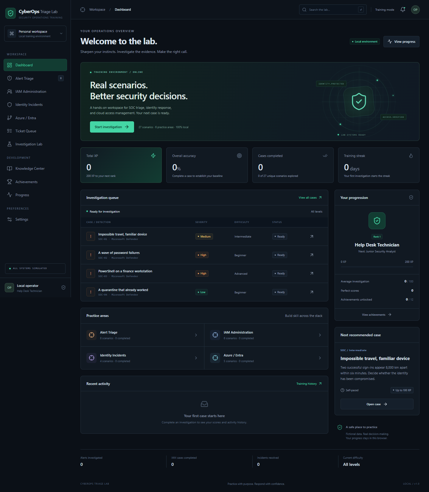
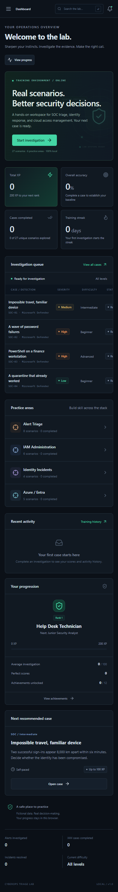

# CyberOps Triage Lab

A local, browser-based cybersecurity training console for practicing SOC triage, identity administration, incident response, and Microsoft cloud access decisions. Built as a functional portfolio MVP with fictional evidence and transparent scoring.

No account, API key, database, backend, or cloud tenant is required. After dependencies are installed, the application runs locally without internet access. Optional Microsoft Learn links in the Knowledge Center require internet access.

## Run locally

Install **Node.js 22 or later with npm**, then run:

```bash
git clone <your-repository-url>
cd cyberops-triage-lab
npm install
npm run dev
```

Open the address printed by Vite, usually **http://127.0.0.1:5173**. The server binds to the loopback interface. If that port is occupied, the normal dev command chooses another port; progress belongs to the browser and exact origin, including its port.

On Windows, you can also double-click `start-lab.cmd`. It starts the local server and prints the browser address. Leave the terminal running while using the lab and press Ctrl+C to stop it.

This initial development workstation had Node but no npm command. A temporary, project-local npm copy is available in `.tools/package` (excluded from Git). On that workstation these equivalent commands work from a terminal with Node available:

```bash
node .tools/package/bin/npm-cli.js install
node .tools/package/bin/npm-cli.js run dev
```

The repository itself uses standard npm scripts; contributors with a regular Node/npm installation do not need `.tools`.

## Features

- Professional dark operations console, optional light theme, and responsive laptop, mobile, and ultrawide layouts.
- Dashboard with rank, XP, decision accuracy, completed cases, streak, SOC/IAM counters, resolved incidents, average score, difficulty, and activity.
- **27 playable scenarios**: 8 SOC alerts, 6 IAM cases, 4 identity incidents, 5 Azure/Entra cases, 2 deeper investigations, and 2 ticket queues.
- Beginner, Intermediate, Advanced, and Expert cases with explicit approval scope, plausible false positives, conflicting change evidence, and insider-risk considerations.
- Investigation workspace with Overview, Sign-ins, Audit Logs, Devices, Permissions, Applications, Timeline, and Notes.
- Searchable event records with filters for user/IP/text, severity, status, event type, and UTC date; expandable records expose all fields.
- Evidence citation, multi-action response selection, and reorderable containment sequences.
- Multiple simultaneous tickets with reorderable priority, business impact, urgency, privilege, and workaround information.
- Access Path Explorer showing direct, group, nested-group, inherited Azure RBAC, directory-role, and active PIM examples.
- Detailed feedback: correct decision, explanation, principle, recommended response, investigation process, alternative-choice reasoning, and practical takeaway.
- 0–100 scoring, XP, 8 ranks, 12 achievement conditions, topic accuracy, seven-day XP visualization, and reviewable case history.
- Training hints or Assessment mode, optional timer and completion sound, saved settings, progress export, and confirmed reset.
- Randomized fictional operator names, safe IP addresses, devices, selected locations/departments, dates, action order, ticket order, and alert IDs. Correct security logic stays unchanged.

## Screenshots

The browser tests generate screenshots in `docs/screenshots/`.



<details>
<summary>Mobile view</summary>



</details>

Additional investigation, access-explorer, and progress screenshots can be added here as the project evolves.

## How to train

1. Open a practice area or start the recommended investigation from Dashboard.
2. Inspect the evidence sources. Click **Cite this evidence** on relevant cards. General cases require at least one core source; deeper Investigation Lab cases require all three.
3. Choose a classification, response actions, and primary security principle. For containment cases, arrange selected actions in the documented playbook order. For ticket cases, rank the tickets in Overview and choose the principle.
4. Record notes if useful, then submit. A completed attempt is saved once, including notes and the ticket order where applicable.
5. Review the debrief and return to the lab or start the next case. Past debriefs remain available from Recent activity and Progress.

**Training Mode** shows a hint during investigation. **Assessment Mode** hides hints until completion. Both modes show explanations afterward. Answers and scenario logic remain client-side, so assessment is a personal practice aid rather than a secure or proctored examination.

The classification convention distinguishes **False Positive** (a detection’s suspicious inference is disproved) from **Benign** (authorized activity, routine administration, or a fully prevented event). Ticket queues use a priority order rather than incident classification.

## Scoring and progression

| Component          | Maximum | How it is scored                                                                                                                                     |
| ------------------ | ------: | ---------------------------------------------------------------------------------------------------------------------------------------------------- |
| Classification     |      30 | Correct event classification; ticket queues instead use agreement across pairwise priorities.                                                        |
| Investigation      |      25 | Fraction of the three required core evidence sources cited. Duplicate or unknown evidence IDs do not add points.                                     |
| Remediation        |      25 | Correct response coverage, with deductions for extra choices. Ordered cases use correctly sequenced actions; ticket queues use exact rank positions. |
| Security principle |      10 | Correct primary principle for the supplied case.                                                                                                     |
| Efficiency         |      10 | Precision and coverage of selected actions, or ticket priority agreement. No time penalty.                                                           |

XP awards are 100 for scores of 90–100, 80 for 80–89, 60 for 70–79, 40 for 60–69, and 20 below 60. Replays earn XP and count as new attempts; the dashboard also reports unique scenarios separately. A case is counted as a resolved identity/investigation incident when its score is at least 70. Overall accuracy measures classification and ticket-priority decisions; average score also includes investigation and remediation.

Ranks unlock at 0, 200, 500, 1,000, 1,800, 2,800, 4,000, and 5,500 XP, from Help Desk Technician to Security Engineer. Streaks count distinct local calendar days and remain active through the day after the most recent practice. Achievement criteria appear on each achievement card; replay attempts count toward those criteria.

## Technologies

React 19, TypeScript, Vite 6, plain CSS, Lucide icons, browser localStorage, and Web Audio for the optional completion tone. Node’s test runner with `tsx` verifies the engine; Playwright drives browser acceptance tests.

## Project structure

```text
src/
  App.tsx                      Application shell, navigation, persistence boundary
  main.tsx                     React entry point
  styles.css                   Themes, layouts, responsive styles
  components/
    UI.tsx                     Panels, badges, progress bars, accessible dialogs
    Investigation.tsx          Evidence workspace, decisions, ticket ranking, debrief
    LogTable.tsx               Event search, filters, full record inspection
    AccessExplorer.tsx         Mock effective-access paths
    ScenarioTable.tsx          Case queues
    History.tsx                Completed attempt list
  pages/                       Dashboard, cases, knowledge, progress, achievements, settings
  scenarios/catalog.ts         Scenario seeds and catalog construction
  data/                        Knowledge concepts and mock access identities
  types/index.ts               Shared TypeScript interfaces
  utils/
    engine.ts                  Scoring, XP, ranks, persistence validation, randomization
    achievements.ts            Achievement conditions
tests/
  engine.test.ts               Scoring, catalog, persistence, streak, randomization checks
  browser/lab.spec.ts           End-to-end browser acceptance checks
docs/screenshots/              Captured desktop and mobile layouts
```

## Scenario architecture

Scenario content is separate from React and scoring. `src/scenarios/catalog.ts` converts concise `Seed` objects into reusable `Scenario` records. Each scenario carries its stable ID, category, difficulty, severity, profile, evidence, log entries, available actions, correct classification, required evidence, correct actions, principle, hint, explanation, and takeaway.

To add a case, add a seed with a unique ID and three independent evidence facts. Provide plausible distractors, matching remediation, and a primary principle from the existing principle catalog. Set `ordered: true` for cases where the supplied playbook defines a response sequence. Ticket cases provide `tickets` and `ticketOrder`, with identical ID sets. The catalog, queues, and case flow pick up the new scenario automatically. Run the engine tests to validate references and ensure a perfect score is attainable.

`instantiate()` changes safe fictional context without mutating the catalog or answer key. `scoreDecision()` is a pure scoring boundary apart from attempt ID creation. The application persistence boundary is in `App.tsx`, with versioned validation in `parseState()`. These boundaries can later accept a scenario API and a progress repository without coupling the UI to a cloud provider.

## Verification

```bash
npm test
npm run build
npm run test:browser
npm run format:check
```

The browser suite is configured for installed Microsoft Edge (`channel: 'msedge'`). On a machine without Edge, install a Playwright browser with `npx playwright install chromium` and remove `channel: 'msedge'` from `playwright.config.ts` to use it. The suite starts a loopback Vite server on port 5173, completes all catalog cases, verifies scores and persistence after refresh, exercises settings/reset, explores access paths, tests log filters and notes, and captures responsive screenshots. It checks for uncaught runtime errors.

Build output is written to `dist/`. Run `npm run preview` to inspect that build locally. This is an SPA with in-memory navigation, so there is no server-side routing dependency.

## Data and privacy

Progress and preferences use the key `cyberops-triage-lab.v1` in localStorage. No training data is transmitted to a service. Open investigations and draft notes live only in memory; closing an unfinished case discards its draft. Submitted notes are part of the saved attempt. Export creates a JSON backup; importing backups is not implemented in this MVP. Browser storage failures produce a visible warning and the current session continues in memory.

Reset requires a confirmation and removes attempt history while retaining settings. Clearing browser site data also clears progress. Browser storage is editable and is not a tamper-resistant leaderboard or record system.

## Future roadmap

- More parameterized evidence, distinct Windows Event Log records, and scenario authoring validation.
- Optional Microsoft Graph and Azure **demo tenant** connectors with clear separation from simulation.
- Local progress import, migration tools, and instructor dashboards.
- AI-generated cases with validated answer keys and instructor review.
- Multiplayer SOC exercises, accounts, and opt-in leaderboards.
- Certification practice tracks: Security+, SC-900, SC-300, and AZ-104.
- Additional Splunk, Microsoft Sentinel, and Microsoft Defender case packs.

These are future features, not inactive controls in the current UI.

## Security disclaimer

This project is an educational simulator, not a production incident-response or administrative tool. All identities, tenants, devices, apps, approvals, and incidents are fictional. IPs use documentation ranges and domains use fictional or reserved examples. No real credentials, authentication tokens, malicious binaries, weaponized scripts, or attack automation are included. Simulated actions never modify a real system.

The supplied playbook and evidence determine the answer for each case. Real containment must account for token lifetime, resource-side and app-local sessions, workload dependencies, retained data, and organizational policy. Microsoft Entra directory roles and Azure resource roles are distinct; the explorer does not model a directory role as automatically granting Azure access. Nested-group behavior varies by service.

Optional authoritative references are included in the Knowledge Center: [session revocation](https://learn.microsoft.com/en-us/entra/identity/users/users-revoke-access), [Azure RBAC scope](https://learn.microsoft.com/en-us/azure/role-based-access-control/scope-overview), [Reader permissions](https://learn.microsoft.com/en-us/azure/role-based-access-control/built-in-roles/general), and [PIM concepts](https://learn.microsoft.com/en-us/entra/id-governance/privileged-identity-management/pim-configure).
